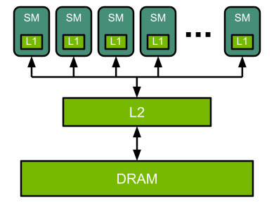

# [GPU Performance Background](https://docs.nvidia.com/deeplearning/performance/dl-performance-gpu-background/index.html) #
## 1.Overview ##
- GPU 的基本结构[(GPU 架构基础)](#2-gpu-architecture-fundamentals)
- 如何并行划分和执行操作[(GPU 执行模型)](#3-gpu-execution-model)
- 如何使用算术强度估计性能限制[(了解性能)](#4-understanding-performance)
- 深度学习操作的松散类别以及倾向于应用于每个操作的性能限制[(DNN 操作类别)](#5-dnn-operation-categories)
## 2. GPU Architecture Fundamentals ##
NVIDIA® GPU 由许多 流式多处理器 （Streaming Multiprocessors, SM）、片上 L2 缓存（on-chip L2 cache）和高带宽 DRAM （high-bandwidth DRAM）组成。算术和其他指令由 SM 执行;数据和代码通过二级缓存从 DRAM 访问。每个SM都有自己的指令调度器和各种指令执行管道。

乘法-加法 是现代神经网络中最常见的操作。每个乘法加法包含两个操作，因此将吞吐量乘以 2 以获得每个时钟的 FLOP 计数。再将其乘以 SM 数量和 SM 时钟频率获得 GPU 的 FLOPS 速率。

$FLOPS\ rate = 2\ ×\ throughput\ ×\ number of\ SMs\ ×\ SM\ clock\ rate$

## 3. GPU Execution Model ##
为了利用其并行资源，GPU 同时执行多个线程。
1. GPU 使用 2 级线程层次结构执行函数。给定函数的线程被分组为大小相等的线程块，并启动一组线程块来执行该函数。
2. GPU 通过切换到其他线程的执行来隐藏依赖指令延迟。因此，有效利用 GPU 所需的线程数远高于内核或指令流水线的数量。

2 级线程层次结构是 GPU 具有许多 SM 的结果，每个 SM 又具有用于执行许多线程的管道，并使其线程能够通过共享内存和同步进行通信。在运行时，线程块被放置在 SM 上进行执行，使线程块中的所有线程能够有效地通信和同步。

使用术语 wave 来指代一组并发运行的线程块。
## 4. Understanding Performance ##
给定处理器上功能的性能受以下三个因素的限制：内存带宽、数学带宽和延迟。

***要估算特定矩阵乘法是数学限制还是内存限制***，
考虑一个简化模型，其中函数从内存中读取其输入，执行数学运算，然后将其输出写入内存。说$T_{mem}$时间花在访问内存上，$T_{math}$时间花在执行数学运算上。如果我们进一步假设不同线程的内存和数学部分可以重叠，则该函数的总时间为 $max(T_{mem},T_{math})$。两个时间中较长的时间表明了限制性能的原因：如果数学时间更长，我们说函数是**数学限制**的，如果内存时间更长，那么它就是**内存限制**的。

$T_{math}>T_{mem}$可以表示为<math xmlns="http://www.w3.org/1998/Math/MathML"> <mrow> <mo> # </mo> <mi> ops </mi> <mtext fontfamily="Times New Roman"> </mtext> <mo> / </mo> <mtext fontfamily="Times New Roman"> </mtext> <msub> <mi> BW </mi> <mi> math </mi> </msub> <mtext fontfamily="Times New Roman"> </mtext> <mi> &gt; </mi> <mtext fontfamily="Times New Roman"> </mtext> <mo> # </mo> <mi> bytes </mi> <mtext fontfamily="Times New Roman"> </mtext> <mo> / </mo> <mtext fontfamily="Times New Roman"> </mtext> <msub> <mi> BW </mi> <mi> mem </mi> </msub> </mrow> </math>，即<math xmlns="http://www.w3.org/1998/Math/MathML"> <mrow> <mo> # </mo> <mi> ops </mi> <mtext fontfamily="Times New Roman"> </mtext> <mo> / </mo> <mtext fontfamily="Times New Roman"> </mtext> <mo> # </mo> <mi> bytes </mi> <mtext fontfamily="Times New Roman"> </mtext> <mi> &gt; </mi> <mtext fontfamily="Times New Roman"> </mtext> <msub> <mi> BW </mi> <mi> math </mi> </msub> <mtext fontfamily="Times New Roman"> </mtext> <mo> / </mo> <mtext fontfamily="Times New Roman"> </mtext> <msub> <mi> BW </mi> <mi> mem </mi> </msub> </mrow> </math>
左侧，算法实现操作的比率和访问的字节数，称为算法的**算术强度**。右侧是处理器的数学和内存带宽之比，有时称为**运算：字节比(ops:byte)**。因此，如果算法的算术强度高于处理器的运算：字节比，则算法在给定处理器上受到数学限制。相反，如果算法的算术强度低于处理器的比率，则算法会受到内存限制。
## 5. DNN Operation Categories ##

### 5.1. Elementwise Operations ###
元素运算可以是一元运算或二元运算。

此类别中的层独立于张量中的所有其他元素，对每个元素执行数学运算。
### 5.2. Reduction Operations ###
约简运算生成在一系列输入张量值上计算的值。

### 5.3. Dot-Product Operations ###
点积运算可以表示为来自两个张量的元素的点积，通常是权重（学习参数）张量和激活张量。
## 6. Summary ##
要大致了解限制给定 GPU 上特定功能性能的因素，可以采取以下步骤：

1.查找 GPU 上的 SM 数量，并确定 GPU 的运算：字节比。

2.计算算法的算术强度。

3.通过估计线程块的数量和大小，确定是否有足够的并行度来使 GPU 饱和。
>如果线程块的数量至少比 SM 的数量高出大约 4 倍，并且每个线程块由几百个线程组成，则可能有足够的并行性。

4.最可能的性能限制因素是：
- 如果没有足够的并行性 -> **延迟**
- 如果有足够的并行度和算法，算术强度高于 GPU 运算：字节比 -> **数学限制**
- 内存如果有足够的并行度和算法算术强度低于 GPU 运算：字节比 -> **内存限制**