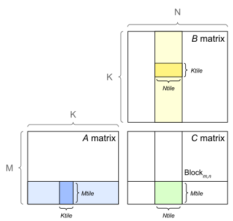

# [Matrix Multiplication](https://docs.nvidia.com/deeplearning/performance/dl-performance-matrix-multiplication/index.html#mat-mat-multi) #
## 关键字 ##
- [GEMM](#1)
- [数学限制与内存限制 Math And Memory Bounds](#2)
  - FLOPS/B
  - 运算：字节比 ops:byte
  - [算术强度 Arithmetic Intensity](#3)

## 1. Background: Matrix-Matrix Multiplication ##
<a id="1"></a>GEMM - General Matrix Multiplications，通用矩阵乘法

GEMM被定义为操作$C=\alpha AB$+$\beta C$
，其中$A$和$B$是矩阵输入，$\alpha$和$\beta$是标量输入，$C$是一个现有矩阵，其被输出覆盖。一般$\alpha=1$，$\beta=0$。

## 2. Math And Memory Bounds ##
设矩阵$A_{M*K}$，即M行和K列。类似地，$B_{K*N}$，$C_{M*N}$。

计算此乘积需要`M * N * K`个融合乘加（fused multiply-adds, FMA）操作。每个FMA是2个操作，一个乘法和一个加法，因此需要总共2 * M * N * K个FLOPS。为简单起见，我们暂时忽略了α和β参数。

***要估算特定矩阵乘法是数学限制还是内存限制***，我们将其算术强度与GPU的`ops:byte(运算:字节比)`进行比较，如 [4. Understanding Performance](https://docs.nvidia.com/deeplearning/performance/dl-performance-gpu-background/index.html#understand-perf) 所述。<a id="2"></a>
>考虑一个简化模型，其中函数从内存中读取其输入，执行数学运算，然后将其输出写入内存。说$T_{mem}$时间花在访问内存上，$T_{math}$时间花在执行数学运算上。如果我们进一步假设不同线程的内存和数学部分可以重叠，则该函数的总时间为 $max(T_{mem},T_{math})$。两个时间中较长的时间表明了限制性能的原因：如果数学时间更长，我们说函数是**数学限制**的，如果内存时间更长，那么它就是**内存限制**的。
>
>$T_{math}>T_{mem}$可以表示为<math xmlns="http://www.w3.org/1998/Math/MathML"> <mrow> <mo> # </mo> <mi> ops </mi> <mtext fontfamily="Times New Roman"> </mtext> <mo> / </mo> <mtext fontfamily="Times New Roman"> </mtext> <msub> <mi> BW </mi> <mi> math </mi> </msub> <mtext fontfamily="Times New Roman"> </mtext> <mi> &gt; </mi> <mtext fontfamily="Times New Roman"> </mtext> <mo> # </mo> <mi> bytes </mi> <mtext fontfamily="Times New Roman"> </mtext> <mo> / </mo> <mtext fontfamily="Times New Roman"> </mtext> <msub> <mi> BW </mi> <mi> mem </mi> </msub> </mrow> </math>，即<math xmlns="http://www.w3.org/1998/Math/MathML"> <mrow> <mo> # </mo> <mi> ops </mi> <mtext fontfamily="Times New Roman"> </mtext> <mo> / </mo> <mtext fontfamily="Times New Roman"> </mtext> <mo> # </mo> <mi> bytes </mi> <mtext fontfamily="Times New Roman"> </mtext> <mi> &gt; </mi> <mtext fontfamily="Times New Roman"> </mtext> <msub> <mi> BW </mi> <mi> math </mi> </msub> <mtext fontfamily="Times New Roman"> </mtext> <mo> / </mo> <mtext fontfamily="Times New Roman"> </mtext> <msub> <mi> BW </mi> <mi> mem </mi> </msub> </mrow> </math>
><a id="3"></a>
>左侧，算法实现操作的比率和访问的字节数，称为算法的**算术强度**。右侧是处理器的数学和内存带宽之比，有时称为**运算：字节比(ops:byte)**。因此，如果算法的算术强度高于处理器的运算：字节比，则算法在给定处理器上受到数学限制。相反，如果算法的算术强度低于处理器的比率，则算法会受到内存限制。
>
>
>  <math xmlns="http://www.w3.org/1998/Math/MathML"> <mrow> <mi> `算术强度 Arithmetic ` </mi> <mtext fontfamily="Times New Roman"> </mtext> <mi> `Intensity` </mi> <mtext fontfamily="Times New Roman"> </mtext> <mo> = </mo> <mfrac> <mrow> <mi> number </mi> <mtext fontfamily="Times New Roman"> </mtext> <mi> of </mi> <mtext fontfamily="Times New Roman"> </mtext> <mi> FLOPS </mi> </mrow> <mrow> <mi> number </mi> <mtext fontfamily="Times New Roman"> </mtext> <mi> of </mi> <mtext fontfamily="Times New Roman"> </mtext> <mi> byte </mi> <mtext fontfamily="Times New Roman"> </mtext> <mi> accesses </mi> </mrow> </mfrac> <mtext fontfamily="Times New Roman"> </mtext> <mo> = </mo> <mfrac> <mrow> <mn> 2 </mn> <mtext fontfamily="Times New Roman"> </mtext> <mo lspace="2px" rspace="2px"> · </mo> <mtext fontfamily="Times New Roman"> </mtext> <mo> ( </mo> <mrow> <mi> M </mi> <mtext fontfamily="Times New Roman"> </mtext> <mo lspace="2px" rspace="2px"> · </mo> <mtext fontfamily="Times New Roman"> </mtext> <mi> N </mi> <mo lspace="2px" rspace="2px"> · </mo> <mtext fontfamily="Times New Roman"> </mtext> <mi> K </mi> </mrow> <mo> ) </mo> </mrow> <mrow> <mn> 2 </mn> <mtext fontfamily="Times New Roman"> </mtext> <mo lspace="2px" rspace="2px"> · </mo> <mtext fontfamily="Times New Roman"> </mtext> <mo> ( </mo> <mrow> <mi> M </mi> <mtext fontfamily="Times New Roman"> </mtext> <mo lspace="2px" rspace="2px"> · </mo> <mtext fontfamily="Times New Roman"> </mtext> <mi> K </mi> <mo lspace="2px" rspace="2px"> + </mo> <mi> N </mi> <mtext fontfamily="Times New Roman"> </mtext> <mo lspace="2px" rspace="2px"> · </mo> <mtext fontfamily="Times New Roman"> </mtext> <mi> K </mi> <mo lspace="2px" rspace="2px"> + </mo> <mi> M </mi> <mtext fontfamily="Times New Roman"> </mtext> <mo lspace="2px" rspace="2px"> · </mo> <mtext fontfamily="Times New Roman"> </mtext> <mi> N </mi> </mrow> <mo> ) </mo> </mrow> </mfrac> <mtext fontfamily="Times New Roman"> </mtext> <mo> = </mo> <mfrac> <mrow> <mi> M </mi> <mtext fontfamily="Times New Roman"> </mtext> <mo lspace="2px" rspace="2px"> · </mo> <mtext fontfamily="Times New Roman"> </mtext> <mi> N </mi> <mtext fontfamily="Times New Roman"> </mtext> <mo lspace="2px" rspace="2px"> · </mo> <mtext fontfamily="Times New Roman"> </mtext> <mi> K </mi> </mrow> <mrow> <mi> M </mi> <mtext fontfamily="Times New Roman"> </mtext> <mo lspace="2px" rspace="2px"> · </mo> <mtext fontfamily="Times New Roman"> </mtext> <mi> K </mi> <mo lspace="2px" rspace="2px"> + </mo> <mi> N </mi> <mtext fontfamily="Times New Roman"> </mtext> <mo lspace="2px" rspace="2px"> · </mo> <mtext fontfamily="Times New Roman"> </mtext> <mi> K </mi> <mo lspace="2px" rspace="2px"> + </mo> <mi> M </mi> <mtext fontfamily="Times New Roman"> </mtext> <mo lspace="2px" rspace="2px"> · </mo> <mtext fontfamily="Times New Roman"> </mtext> <mi> N </mi> </mrow> </mfrac> </mrow> </math>

假设正在使用NVIDIA® V100 GPU和FP16输入的Tensor Core操作，带有FP32累积，如果数据从GPU内存加载，则FLOPS:B比率为138.9。

>`FLOPS/B`（Floating Point Operations Per Second per Byte）是指每秒钟计算的浮点运算次数与内存传输的字节数之比。这个指标通常用于衡量计算机系统的性能，特别是在涉及大量浮点运算和内存访问的科学计算和数据处理领域。FLOPS/B越高，表示系统在单位时间内能够执行更多的浮点运算，并且具有更高的计算效率。

作为示例，让我们考虑一个M x N x K = 8192 x 128 x 8192的GEMM。对于这种特定情况，算术强度为124.1 FLOPS/B，低于V100的138.9 FLOPS:B，因此该操作将受到内存限制。如果我们将GEMM大小增加到8192 x 8192 x 8192，算术强度增加到2730，远高于V100的FLOPS:B，因此该操作将受到数学限制。

特别地，从这个分析可以看出，矩阵-向量乘积（通用矩阵-向量乘积或GEMV），其中M=1或N=1，始终受到内存限制；它们的算术强度小于1。

### 2.1. GPU Implementation ###

GPU 通过将输出矩阵划分为多个tiles来实现 GEMM，然后将这些tiles分配给thread blocks。

tile size: 图 1 中的 Mtile x Ntile。每个thread block单步执行tile中的 K 维，从 A 和 B 矩阵加载所需值，然后将它们相乘并累加到输出中来计算其output tile。


### 2.2. Tensor Core Requirements ###
最新的 NVIDIA GPU 引入了 Tensor Core，以最大限度地提高张量乘法的速度。当等效矩阵维度 M、N 和 K 对齐到 16 字节（或 A100 上的 128 字节）的倍数时，性能会更好。

例如，当使用 FP16 数据时，每个 FP16 元素由 2 个字节表示，因此矩阵维度需要是 8 个元素的倍数才能获得最佳效率（或 A100 上的 64 个元素）。

### 2.3. Typical Tile Dimensions In cuBLAS And Performance ###

This tradeoff between tile efficiency and tile parallelism suggests that the larger the GEMM, the less important this tradeoff is: at some point, a GEMM has enough work to use the largest available tiles and still fill the GPU. 

larger GEMMs achieve higher throughput.
更大的GEMM可实现更高的吞吐量。

## 3. Dimension Quantization Effects ##

two potential effects on execution efficiency - tile and wave quantization.

### 3.1. Tile Quantization ###

Tile quantization occurs when matrix dimensions are not divisible by the thread block tile size. 当矩阵尺寸不能被线程块大小整除时，就会发生tile quantization。

虽然tiles数量保持不变,但包含有用数据的tiles比例,以及因此执行的有用 FLOPS 数量会随着 N 的增加而增加。作为一个示例，这在下图中的 GFLOPS 值中有所反映。当 output matrix dimensions 可被 tile size 整除时，可实现最高的利用率。

注意：只要tiles数量保持不变，执行时间也是恒定的。


### 3.2. Wave Quantization ###

While tile quantization means the problem size is quantized to the size of each tile, there is a second quantization effect where the total number of tiles is quantized to the number of multiprocessors on the GPU: Wave quantization. 在 tile quantization 中，问题大小被量子化为每个 tile 的大小。而 wave quantization 是指，生成的网格总数被量子化为GPU上多处理器的数量。

示例：


两种 quant throughput - duration graphs 非常相似，只是在水平轴上的比例不同。

区别在于量化发生的位置：tile-quant意味着工作被量化到tiles的大小，而wave-quant则意味着工作被量化到 GPU 的大小。图表中的第 7 (c) 图和第 8 (c) 图(Numbers of Tiles for NT GEMM)展示了这种区别。

注意事项
## [matrixMul - 矩阵乘法（CUDA Runtime API版本）](https://github.com/NVIDIA/cuda-samples/tree/master/Samples/0_Introduction/matrixMul) ##
### 描述 ###
此示例实现了矩阵乘法，与编程指南中的第6章完全相同。它被编写为便于说明各种CUDA编程原则，而不是为了提供最具性能的通用矩阵乘法核心。为了展示GPU矩阵乘性能，此示例还展示了如何使用新的CUDA 4.0界面用于CUBLAS，以展示高性能矩阵乘法。

### 关键概念 ###
CUDA Runtime API，线性代数

### 构建和运行 ###
Windows
Windows示例使用Visual Studio IDE构建。提供了每个受支持的Visual Studio版本的解决方案文件（.sln），格式为：
```
*_vs<version>.sln
```
 - 适用于Visual Studio \<version>

每个单独样本在其目录中有一组解决方案文件.
