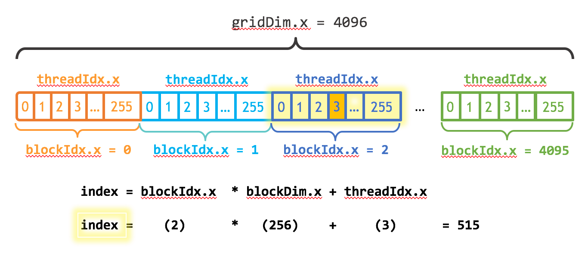

# [An Even Easier Introduction to CUDA](https://developer.nvidia.com/blog/even-easier-introduction-cuda/#memory-allocation) #
## Starting Simple ##

A simple C++ program that adds the elements of two arrays with a million elements each.

```cpp
//  add.cpp
#include <iostream>
#include <math.h>

// function to add the elements of two arrays
void add(int n, float *x, float *y)
{
  for (int i = 0; i < n; i++)
      y[i] = x[i] + y[i];
}

int main(void)
{
  int N = 1<<20; // 1M elements

  float *x = new float[N];
  float *y = new float[N];

  // initialize x and y arrays on the host
  for (int i = 0; i < N; i++) {
    x[i] = 1.0f;
    y[i] = 2.0f;
  }

  // Run kernel on 1M elements on the CPU
  add(N, x, y);

  // Check for errors (all values should be 3.0f)
  float maxError = 0.0f;
  for (int i = 0; i < N; i++)
    maxError = fmax(maxError, fabs(y[i]-3.0f));
  std::cout << "Max error: " << maxError << std::endl;

  // Free memory
  delete [] x;
  delete [] y;

  return 0;
}
```

 - `__global__` tells the CUDA C++ compiler that this is a function that runs on the GPU and can be called from CPU code.
## Memory Allocation in CUDA ##

 -   |C++          | CUDA                  |
     |-------------|-----------------------|
     | `malloc()`  | `cudaMallocManaged()` |
     | `delete []` | `cudaFree()`          |

 -     add<<<1, 1>>>(N, x, y);
    launch the `add()` kernel, which invokes it on the GPU. CUDA kernel launches are specified using the triple angle bracket syntax `<<< >>>`.

 -     cudaDeviceSynchronize();
    CPU wait until the kernel is done before it accesses the results.

Complete code:
```cpp
//add.cu
#include <iostream>
#include <math.h>
// Kernel function to add the elements of two arrays
__global__
void add(int n, float *x, float *y)
{
  for (int i = 0; i < n; i++)
    y[i] = x[i] + y[i];
}

int main(void)
{
  int N = 1<<20;
  float *x, *y;

  // Allocate Unified Memory – accessible from CPU or GPU
  cudaMallocManaged(&x, N*sizeof(float));
  cudaMallocManaged(&y, N*sizeof(float));

  // initialize x and y arrays on the host
  for (int i = 0; i < N; i++) {
    x[i] = 1.0f;
    y[i] = 2.0f;
  }

  // Run kernel on 1M elements on the GPU
  add<<<1, 1>>>(N, x, y);

  // Wait for GPU to finish before accessing on host
  cudaDeviceSynchronize();

  // Check for errors (all values should be 3.0f)
  float maxError = 0.0f;
  for (int i = 0; i < N; i++)
    maxError = fmax(maxError, fabs(y[i]-3.0f));
  std::cout << "Max error: " << maxError << std::endl;

  // Free memory
  cudaFree(x);
  cudaFree(y);
  
  return 0;
}
```
Shall output:
```
Max error: 0
```

## Profile it! ##

the simplest way to find out how long the kernel takes to run is to run it with `nvprof`, the command line GPU profiler that comes with the CUDA Toolkit. 

## Picking up the Threads ##
实现并行化，需要在 CUDA 的 `<<<1, 1>>>` 语法中做出调整。这被称为**执行配置**，它告诉 CUDA 运行时在 GPU 上启动时要使用多少并行线程。

这里有两个参数，但让我们从修改第二个参数开始：**线程块中的线程数**。CUDA GPU 使用大小为 32 的线程块运行内核，因此选择 256 个线程是一个合理的大小。

    add<<<1, 256>>>(N, x, y); 

再修改循环，让内核能获取运行线程的索引，以使用并行线程遍历数组。

`threadIdx.x` 包含其块内当前线程的索引，`blockDim.x` 包含块中的线程数。
```cpp
__global__
void add(int n, float *x, float *y)
{
  int index = threadIdx.x;
  int stride = blockDim.x;
  for (int i = index; i < n; i += stride)
      y[i] = x[i] + y[i];
}
```
保存以上全部更改为add_block.cu。
## Out of the Blocks ##
 - 许多并行处理器组成了“流处理多处理器”（Streaming Multiprocessors，SMs）。每个SM可以运行多个并发的线程块。

 - **执行配置**的第一个参数指定了**线程块的数量**。并行线程块组成了被称为“网格”的结构。
  
   有N个元素需要处理，每个线程块有256个线程，只需要计算出至少有N个线程所需的线程块数量。将N除以块大小（要小心地向上舍入，以防N不是blockSize的倍数）即可。

   ```cpp
   int blockSize = 256;
   int numBlocks = (N + blockSize - 1) /   blockSize;
   add<<<numBlocks, blockSize>>>(N, x, y);
   ```
  

- CUDA 提供`gridDim.x`，其中包含网格中的块数，以及 `blockIdx.x`，其中包含网格中当前线程块的索引。
  
    图1说明了对数组（一维）进行索引的方法。每个线程索引获取：`index = blockIdx.x * blockDim.x + threadIdx.x` 

- 更新的核心还将stride设置为网格中线程总数(`blockDim.x * gridDim.x`)。通常称为**grid-stride循环**。
  ```cpp
  __global__
  void add(int n, float *x, float *y)
  {
    int index = blockIdx.x * blockDim.x + threadIdx.x;
    int stride = blockDim.x * gridDim.x;
    for (int i = index; i < n; i += stride)
    y[i] = x[i] + y[i];
  }
  ```
保存以上全部更改为add_grid.cu。

## Exercises ##
## Where To From Here? ##
